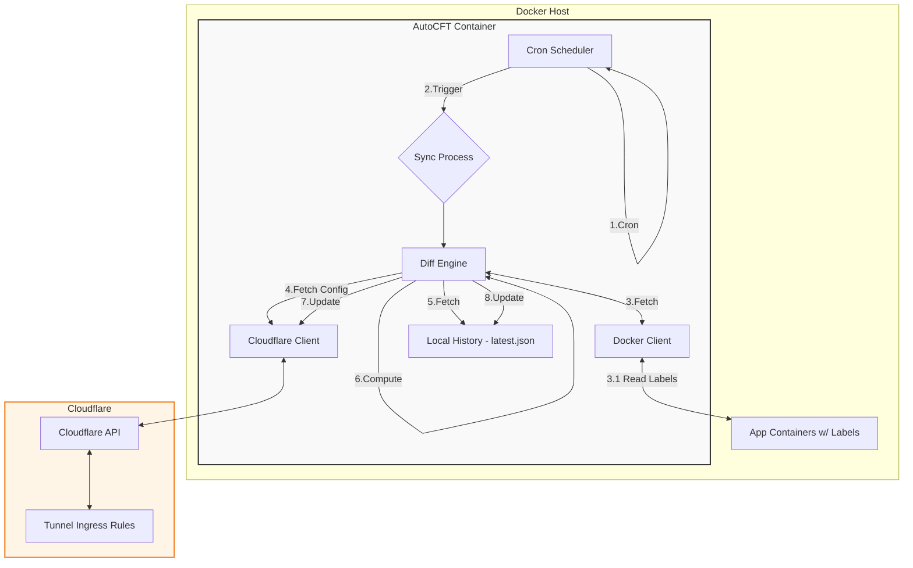

# Architecture

<!-- diagram id="en-1" caption: "architecture" -->

## Core Modules
- Cron Scheduler: robfig/cron (seconds precision) triggers periodic sync.
- Docker Client: lists containers to read labels.
- Cloudflare Client: calls `cloudflare-go` v6 API.
- Diff Engine: merges three sets (history / current / container labels).
- History Store: single JSON file.

## Merge Logic
1. Fetch Cloudflare ingress list (remove fallback 404 entry).
2. If history exists: web‑managed routes = Cloudflare list − history (by hostname). On first run treat all as web‑managed.
3. Parse container labels.
4. Merge web‑managed + container label routes; on hostname collision container overrides.
5. Append required fallback 404 (Tunnel requires this rule).

## Idempotence
If newly computed list (excluding fallback 404) matches history exactly (compare hostname + path + origin fields) skip update to avoid unnecessary API calls.

## Concurrency Control
Atomic flag prevents re‑entry while previous sync still running.

## Failure Handling
- Cloudflare API request fails: skip this run; do not write history.
- Container enumeration fails: skip this run.
- Single container label validation fails: skip only that container.

## Future Plans
- Add web UI.
- Add notification features.