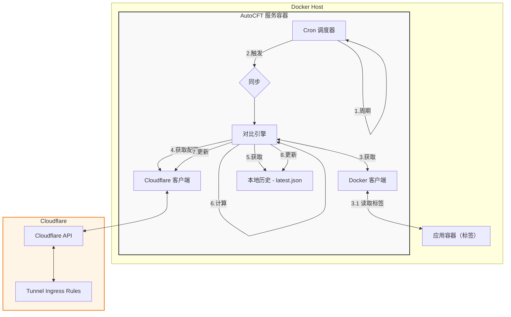

# 架构设计

<!-- diagram id="zh-1" caption: "系统流程图" -->

## 核心模块
- Cron 调度：robfig/cron 秒级触发。
- Docker Client：列出容器获取标签。
- Cloudflare Client：调用 `cloudflare-go` v6 API。
- 对比引擎：三方集合（历史/现有/容器标签）合并。
- 历史存储：单 JSON 文件。

## 配置概览
- 通过环境变量配置系统参数与全局 Origin 选项。
- 通过容器标签定义每个服务的 Ingress 规则与 Origin 选项。
- 定时任务拉取当前 Tunnel 配置，合并标签驱动条目并更新（保留 Web 管理条目）。
- 历史文件保存在 `${AUTOCFT_BASEDIR}/latest.json`。
- 支持自动触发同步与 Dry Run 模式。
- 内置 PocketBase 预留未来 Web UI 能力。

## 合并逻辑
1. 拉取 Cloudflare ingress（去除 fallback 404）。
2. 若存在历史：网页管理路由 = Cloudflare 集合 - 历史（按 hostname）。首次运行则全部视为网页管理路由。
3. 解析容器标签。
4. 合并 网页管理路由 + 容器配置路由，hostname 冲突容器覆盖。
5. 追加必需的 fallback 404（为Tunnel种必须的规则）。

## 幂等性
若新计算出的（除 fallback 404）列表与历史完全一致（按 hostname + path + origin 字段比较），则跳过更新，避免不必要的 API 调用。

## 并发控制
Atomic 标志避免上一次同步未完成时再次进入。

## 失败处理
- Cloudflare API 请求失败：本次跳过，不写入历史记录。
- 获取容器失败：本次跳过。
- 单个容器标签数据校验失败：仅跳过该容器。

## 未来计划
- 增加Web界面
- 增加通知的功能
